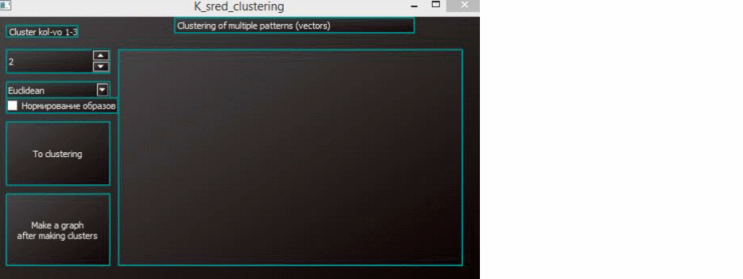

# PATTERN_RECOGNITION

PyQt5,scipy,matplotlib,numpy

The method of clustering by k averages requires the number of clusters to be set to k. 
The first step in the feature space, the position of k centers of clusters is chosen arbitrarily, not necessarily coinciding with any images. 
Then at each step, first, each image belongs to that cluster, the distance to the center of which for it is minimal, and secondly, after all images have been distributed into clusters the position of the cluster centers is recalculated. 
The process continues until the the composition of the clusters is stabilized.

example:  
  
  